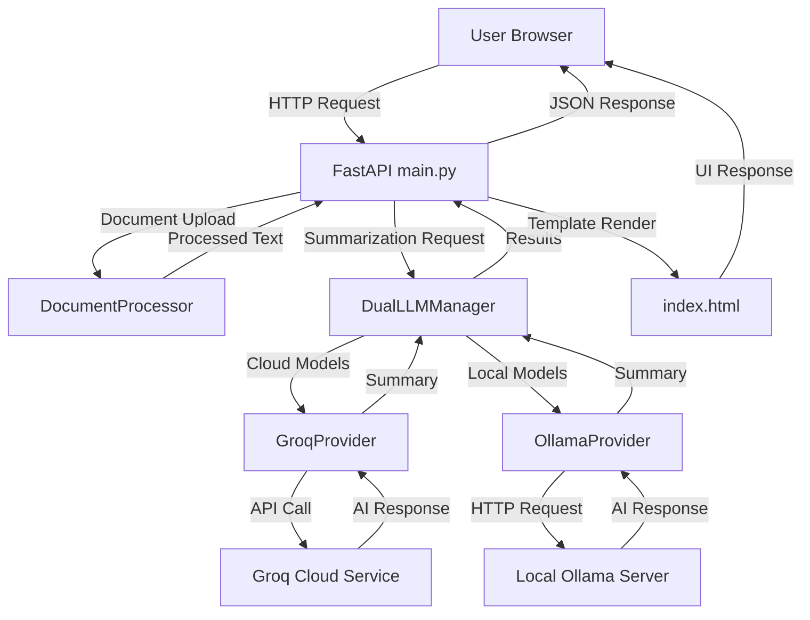

# 🏗️ AI Summarization Platform - Architecture

## 📁 **Project Structure**

```
ai-summarization-platform/
├── 📦 Root Level
│   ├── main.py                    # 🚀 Application entry point
│   ├── .env                       # 🔒 Environment variables (not tracked)
│   ├── .gitignore                # 🚫 Git ignore rules
│   └── README.md                  # 📖 Main documentation
│
├── 📂 src/                        # 🎯 Source code
│   ├── __init__.py               # Package initialization
│   ├── api/                      # 🌐 API Layer
│   │   ├── __init__.py
│   │   └── main.py               # FastAPI application & routes
│   ├── core/                     # 🧠 Business Logic
│   │   ├── __init__.py
│   │   ├── providers.py          # LLM provider implementations
│   │   └── document_processor.py # Document processing logic
│   ├── ui/                       # 🎨 User Interface
│   │   ├── __init__.py
│   │   └── templates/            # HTML templates
│   │       └── index.html        # Main web interface
│   └── utils/                    # 🛠️ Utilities
│       └── __init__.py           # Helper functions (future)
│
├── 📂 config/                     # ⚙️ Configuration
│   ├── requirements.txt          # 📋 Python dependencies
│   └── env_example.txt          # 📝 Environment template
│
├── 📂 scripts/                    # 🔧 Scripts & Tools
│   ├── setup.sh                 # 🛠️ Platform setup
│   ├── setup_ollama.sh          # 🖥️ Ollama installation
│   ├── run_app.py               # 🚀 Legacy app launcher
│   └── start.sh                 # ▶️ Simple start script
│
├── 📂 docs/                      # 📚 Documentation
│   ├── README.md                # 📖 Main documentation
│   ├── SETUP_GUIDE.md          # 🛠️ Setup instructions
│   ├── PROJECT_STRUCTURE.md    # 🏗️ Project organization
│   ├── GIT_SETUP.md            # 🔄 Git instructions
│   └── ARCHITECTURE.md         # 🏛️ This file
│
└── 📂 tests/                     # 🧪 Test Suite (future)
    └── __init__.py              # Test package
```

## 🏛️ **Architecture Layers**

### **1. 🎯 Presentation Layer (UI)**
```
src/ui/
├── templates/index.html    # Modern glass morphism interface
└── (future: static assets)
```

**Responsibilities:**
- User interface rendering
- Client-side interactions
- Form handling and validation
- Real-time status updates

### **2. 🌐 API Layer**
```
src/api/
└── main.py    # FastAPI application with all routes
```

**Responsibilities:**
- HTTP request handling
- Response formatting
- API documentation (OpenAPI/Swagger)
- Authentication and validation
- Error handling

### **3. 🧠 Business Logic Layer (Core)**
```
src/core/
├── providers.py           # LLM provider implementations
└── document_processor.py  # Document processing logic
```

**Responsibilities:**
- LLM provider management (Groq, Ollama)
- Document processing and validation
- Text analysis and summarization
- Provider switching and comparison

### **4. 🛠️ Infrastructure Layer**
```
config/           # Configuration management
scripts/          # Deployment and setup scripts
docs/            # Documentation and guides
```

**Responsibilities:**
- Environment configuration
- Deployment automation
- Documentation maintenance
- Testing infrastructure

## 🔄 **Data Flow Architecture**



## 🎯 **Component Responsibilities**

### **📱 Frontend (src/ui/templates/index.html)**
- **Modern UI**: Glass morphism design with responsive layout
- **Real-time Updates**: Live status for API connections
- **Interactive Forms**: File upload, model selection, configuration
- **Results Display**: Side-by-side model comparison

### **🌐 API Server (src/api/main.py)**
- **Route Handling**: RESTful endpoints for all operations
- **Provider Management**: API key configuration and validation
- **File Processing**: PDF upload and text extraction
- **Response Formatting**: JSON responses with error handling

### **🧠 Core Logic (src/core/)**

#### **providers.py - LLM Management**
- **DualLLMManager**: Unified interface for all providers
- **GroqProvider**: Cloud-based AI models via Groq API
- **OllamaProvider**: Local AI models via Ollama server
- **Provider Detection**: Auto-discovery of available models

#### **document_processor.py - Document Handling**
- **PDF Processing**: Text extraction from uploaded PDFs
- **Text Validation**: Content validation and sanitization
- **Sample Documents**: Built-in test documents
- **Metrics Calculation**: Word count, character count, analysis

## 🔧 **Configuration Management**

### **Environment Variables (.env)**
```bash
# AI Providers
GROQ_API_KEY=your_groq_key_here
OLLAMA_BASE_URL=http://localhost:11434

# Application Settings
APP_NAME=AI Summarization Platform
HOST=0.0.0.0
PORT=8000
DEBUG=False
```

### **Dependencies (config/requirements.txt)**
```
fastapi>=0.104.0      # Web framework
uvicorn>=0.24.0       # ASGI server
groq>=0.4.0           # Groq API client
ollama>=0.2.0         # Ollama client
PyPDF2>=3.0.0         # PDF processing
python-dotenv>=1.0.0  # Environment management
python-multipart>=0.0.6  # File upload support
jinja2>=3.1.0         # Template engine
requests>=2.31.0      # HTTP requests
```

## 🚀 **Deployment Architecture**

### **Development Mode**
```bash
python main.py --debug --reload
# Automatic reloading, debug logging
```

### **Production Mode**
```bash
python main.py --host 0.0.0.0 --port 8000
# Optimized for production use
```

### **Docker Deployment** (Future)
```dockerfile
FROM python:3.11-slim
COPY . /app
WORKDIR /app
RUN pip install -r config/requirements.txt
CMD ["python", "main.py"]
```

## 🔐 **Security Architecture**

### **API Key Management**
- **Environment Variables**: Secure storage of sensitive keys
- **Masked Display**: Frontend shows masked keys (gsk_****xyz)
- **User Override**: Ability to override environment keys
- **No Logging**: Keys never logged or stored in plain text

### **File Processing Security**
- **Type Validation**: Only PDF files accepted
- **Size Limits**: File size restrictions
- **Content Sanitization**: Text cleaning and validation
- **Temporary Processing**: No permanent file storage

## 📊 **Performance Architecture**

### **Async Processing**
- **FastAPI Async**: Non-blocking request handling
- **Concurrent Requests**: Multiple model calls in parallel
- **Streaming Support**: Ready for streaming responses

### **Caching Strategy** (Future)
- **Model Caching**: Cache frequently used models
- **Response Caching**: Cache recent summarizations
- **Static Asset Caching**: Optimize frontend delivery

## 🔍 **Monitoring & Observability**

### **Logging**
- **Structured Logging**: JSON-formatted logs
- **Error Tracking**: Comprehensive error reporting
- **Performance Metrics**: Response time monitoring

### **Health Checks**
- **Provider Status**: Real-time provider availability
- **Service Health**: Application health endpoints
- **Resource Monitoring**: Memory and CPU usage

## 🎯 **Future Enhancements**

### **Planned Architecture Improvements**
- **Microservices**: Split into separate services
- **Database Layer**: Add persistent storage
- **Authentication**: User management and API keys
- **Rate Limiting**: Request throttling and quotas
- **Caching Layer**: Redis for performance
- **Message Queue**: Background task processing

### **Scalability Considerations**
- **Load Balancing**: Multiple API server instances
- **Database Sharding**: Horizontal scaling
- **CDN Integration**: Global content delivery
- **Container Orchestration**: Kubernetes deployment

---

This architecture provides a solid foundation for a professional, scalable AI summarization platform while maintaining clean separation of concerns and modern development practices.
